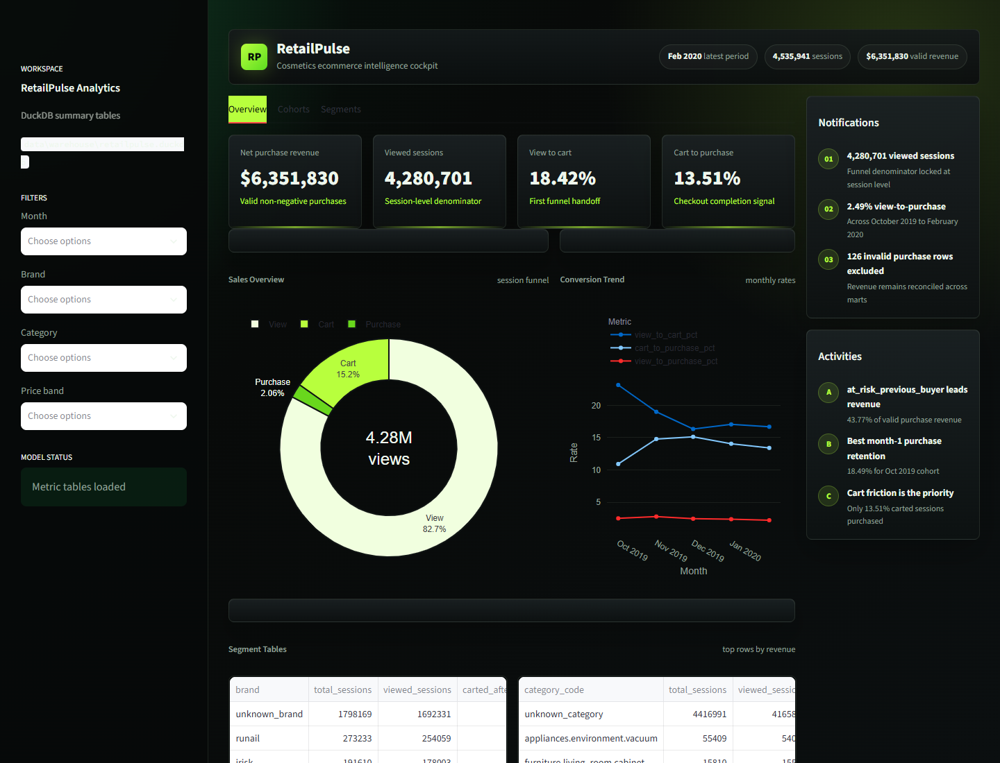
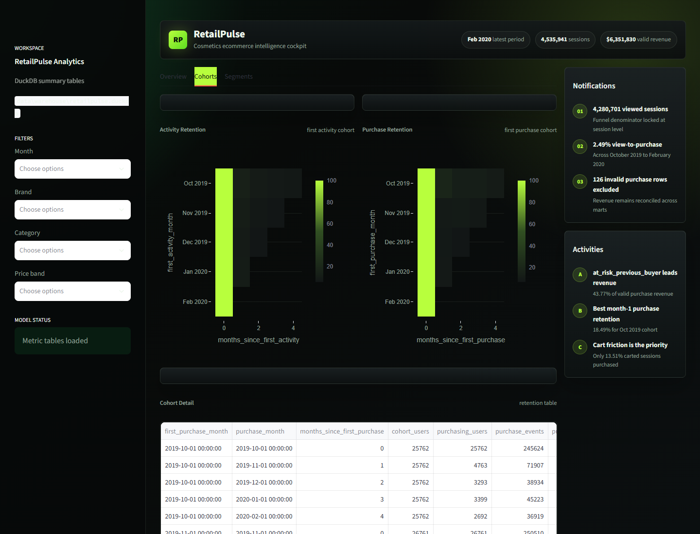
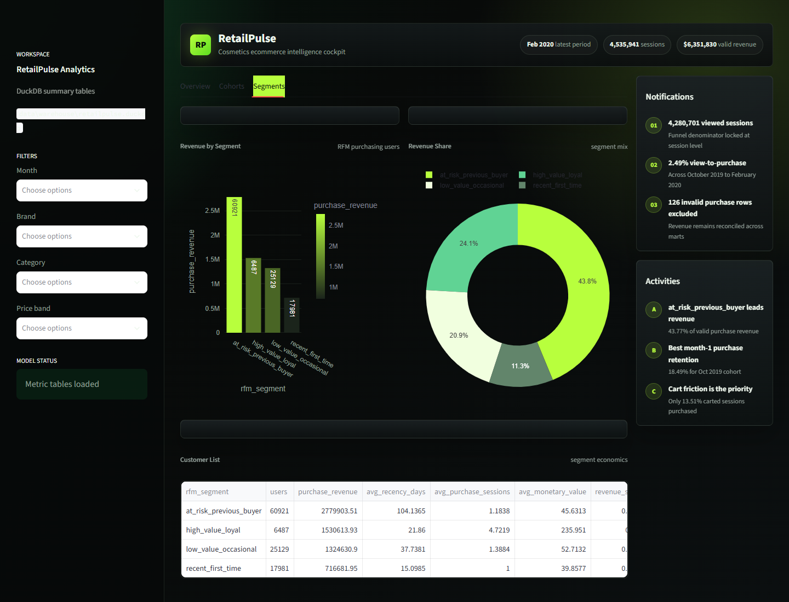

# RetailPulse

RetailPulse is an end-to-end ecommerce product analytics project for a cosmetics storefront. It turns historical clickstream events into session-level funnel metrics, cohort retention views, RFM-style customer segments, and a deployed Streamlit dashboard for business decision-making.

[Live Streamlit Dashboard](https://retailpulse-2kirrjkgesk9uf4w7cuncz.streamlit.app/) | [Case Study](case-study/ecommerce-product-analytics-case-study.md) | [Dashboard Docs](docs/dashboard.md) | [Data Dictionary](docs/data-dictionary.md)



## Project Summary

This project analyzes 20.69M cosmetics ecommerce events from October 2019 through February 2020. The pipeline reconstructs sessions, validates revenue, creates reusable metric tables in DuckDB, exports dashboard-ready CSV summaries, and presents the final findings in a dark Streamlit analytics cockpit.

RetailPulse answers three product analytics questions:

1. Where do users drop off in the view-to-cart-to-purchase funnel?
2. Which first-activity and first-purchase cohorts retain or repurchase?
3. Which brands, categories, and purchasing-user segments convert best?

## Results Snapshot

| Metric | Value |
| --- | ---: |
| Raw events profiled | 20,692,840 |
| Reconstructed sessions | 4,535,941 |
| Valid purchase revenue | $6,351,830.29 |
| View-to-cart rate | 18.42% |
| Cart-to-purchase rate | 13.51% |
| View-to-purchase rate | 2.49% |
| Month-1 purchase retention, October 2019 cohort | 18.49% |
| Revenue share from `at_risk_previous_buyer` | 43.77% |

## Key Findings

The funnel is leaky after product views. Out of 4,280,701 viewed sessions, only 788,430 reached cart after view and 106,526 reached purchase after cart. That produced a 2.49% view-to-purchase rate.

Repeat purchasing weakened after the first cohort. The October 2019 first-purchase cohort reached 18.49% month-1 purchase retention, while later cohorts fell below 10%.

Revenue is concentrated in prior buyers. The `at_risk_previous_buyer` segment generated 43.77% of valid purchase revenue, and the smaller `high_value_loyal` segment generated 24.10%.

## Dashboard

The deployed Streamlit app includes three views:

- Overview: KPI cards, sales overview, conversion trend, and brand/category/price-band tables.
- Cohorts: activity and purchase retention heatmaps with cohort detail.
- Segments: RFM segment revenue, revenue share, and customer-list summary.

The dashboard uses the local DuckDB warehouse when available. On Streamlit Cloud, where the large warehouse file is not committed, it automatically falls back to the tracked metric CSV exports in `data/exports/`.

Additional screenshots:





## Tech Stack

| Layer | Tools |
| --- | --- |
| Data processing | Python, pandas |
| Analytics warehouse | DuckDB |
| Metrics | SQL |
| Dashboard | Streamlit, Plotly |
| Validation | Playwright E2E, exported metric checks |
| Deployment | Streamlit Community Cloud |

## Repository Structure

```text
RetailPulse/
|-- analysis/                         # SQL metric models
|-- case-study/                       # Finished portfolio write-up and screenshots
|-- dashboard/                        # Streamlit dashboard app
|-- data/exports/                     # Tracked dashboard-ready metric CSVs
|-- data/manifest/                    # Dataset manifest metadata
|-- docs/                             # Data dictionary, dashboard notes, validation docs
|-- scripts/                          # Download, profile, ingest, SQL runner, export scripts
|-- sql/                              # Staging quality and session mart SQL
|-- tests/e2e/                        # Playwright dashboard smoke/E2E test
|-- requirements.txt
`-- Makefile
```

## Dataset

Source: [eCommerce Events History in Cosmetics Shop](https://www.kaggle.com/datasets/mkechinov/ecommerce-events-history-in-cosmetics-shop), provided by REES46 Marketing Platform.

Expected raw columns:

- `event_time`
- `event_type`
- `product_id`
- `category_id`
- `category_code`
- `brand`
- `price`
- `user_id`
- `user_session`

Raw data is intentionally not committed. The local workspace can use `data/archive.zip` as the Kaggle archive and extract raw CSVs into `data/raw/cosmetics/`.

## Run Locally

Install dependencies:

```bash
python -m pip install -r requirements.txt
```

Run the pipeline:

```bash
python scripts/download_cosmetics_dataset.py
python scripts/profile_raw_cosmetics.py
python scripts/ingest_raw_events.py
python scripts/run_duckdb_sql.py sql/03_staging_quality.sql
python scripts/run_duckdb_sql.py sql/04_session_mart.sql
python scripts/run_duckdb_sql.py analysis/core_metrics.sql
python scripts/export_metric_tables.py
```

Or, if `make` is available:

```bash
make pipeline
make export
```

Start the dashboard:

```bash
python -m streamlit run dashboard/app.py
```

Close the Streamlit dashboard before rerunning pipeline steps that write to DuckDB. DuckDB allows one writer at a time.

## Generated Artifacts

These are local-only and ignored by Git:

- `data/archive.zip`
- `data/raw/cosmetics/`
- `data/warehouse/retailpulse.duckdb`
- `data/processed/events/`

These dashboard-ready metric exports are committed so the deployed app can run without the full warehouse:

- `data/exports/metric_session_funnel_overall.csv`
- `data/exports/metric_session_funnel_by_month.csv`
- `data/exports/metric_session_funnel_by_brand.csv`
- `data/exports/metric_session_funnel_by_category.csv`
- `data/exports/metric_session_funnel_by_price_band.csv`
- `data/exports/metric_activity_cohort_retention.csv`
- `data/exports/metric_purchase_cohort_retention.csv`
- `data/exports/metric_rfm_segment_summary.csv`

## Metric Definitions

Funnel metrics are session-level:

- View stage: sessions with at least one `view` event.
- Cart stage: sessions with both view and cart events.
- Purchase stage: sessions with view, cart, and purchase events.
- Multiple purchase rows in one session count as one converted session for funnel conversion.
- Revenue sums valid non-negative purchase event prices. Invalid purchase rows are counted separately in quality and session outputs.

Cohort metrics are user-month based:

- Activity cohorts use first activity month.
- Purchase cohorts use first purchase month.
- Activity retention and purchase retention are reported separately.

Segmentation uses purchasing users only:

- `high_value_loyal`
- `recent_first_time`
- `at_risk_previous_buyer`
- `low_value_occasional`

## Validation

Run the dashboard E2E test with Playwright:

```bash
PYTHON="python" node tests/e2e/dashboard.spec.cjs
```

The test starts Streamlit on port `8502`, verifies the Overview, Cohorts, and Segments tabs, and writes an ignored screenshot to `test-results/dashboard-e2e.png`.

The E2E test also supports a deployment-style check by pointing `RETAILPULSE_DUCKDB` at a missing file. In that mode, the app must render from committed CSV metric exports.

## Deployment

The project is deployed on Streamlit Community Cloud:

[https://retailpulse-2kirrjkgesk9uf4w7cuncz.streamlit.app/](https://retailpulse-2kirrjkgesk9uf4w7cuncz.streamlit.app/)

Deployment settings:

- Repository: `fahadsaleem1678/RetailPulse`
- Branch: `main`
- Main file path: `dashboard/app.py`

No secrets are required for the portfolio dashboard because it uses committed metric exports when the local DuckDB warehouse is unavailable.

## Scope Boundaries

Version 1 focuses on batch product analytics. It does not include streaming ingestion, multi-dataset joins, predictive ML, attribution modeling, or production warehouse orchestration.
